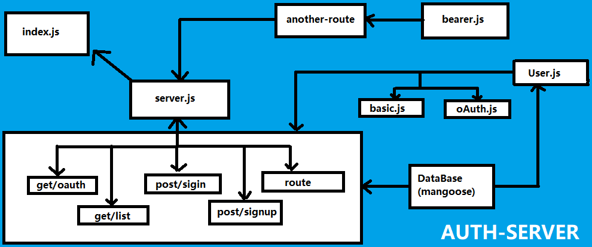

# auth-server

### Author: Ahmed Abu Samaan

### Resources
[PR](https://github.com/AhmedAbuSamaan-401-advanced-javascript/auth-server/pull/3)

### Setup (.env):-
.env =>
PORT
MONGODB_URI
CLIENT_ID
CLIENT_SECRET
API_SERVER

### How to run your application
nodemon

### Libraries:
1. express
2. dotenv
3. supertest
4. mongoose
5. base-64
6. bcryptjs
7. cors
8. jsonwebtoken

### auth-server UML
